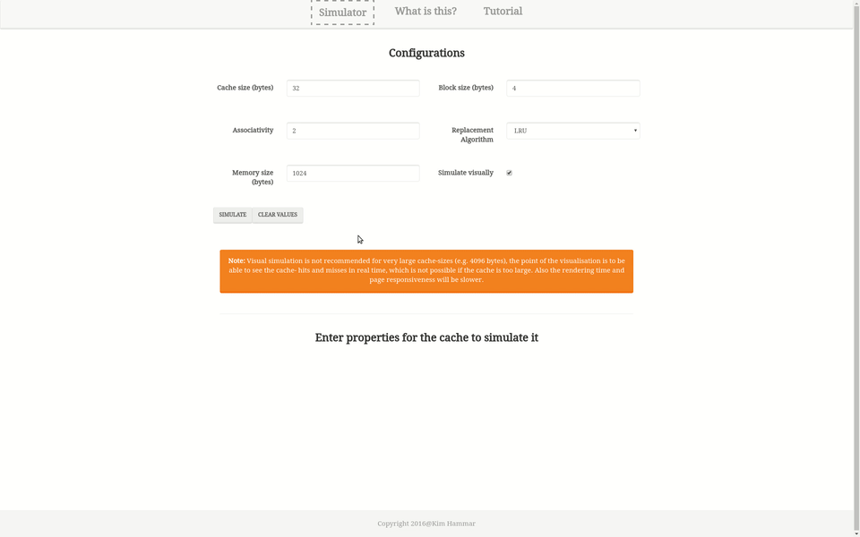

# Cache Simulator

[](https://travis-ci.org/Limmen/cache_simulator)
[](https://david-dm.org/limmen/cache_simulator.svg)

Table of Contents
=================

  * [Cache Simulator](#cache-simulator)
  * [Table of Contents](#table-of-contents)
    * [Description](#description)
    * [Screenshots](#screenshots)
    * [Installation](#installation)
    * [Current State](#current-state)
    * [Future Developments](#future-developments)
    * [Usage](#usage)
    * [Contributions](#contributions)
    * [Copyright and license](#copyright-and-license)

## Description

Cache Simulator for educational purposes. 

The simulator lets you create D-caches and main memories by your preferences and then simulate their behaviour by performing instructions manually or by entering a assembly-like program.

<!---
## Hosted 
[www.cachesimulator.com](http://www.cachesimulator.com/ "www.cachesimulator.com")
-->

## Prerequisites

To run and install the app locally you need node.js >= v0.10.25 and npm (node package manager).

## Installation

1. `git clone https://github.com/Limmen/cache_simulator`
2. `cd cache_simulator`
3. `npm install`
4. `npm start`

## Example



## Usage
The following commands are available in the project:
```bash
# Start for development
$ npm start 

# Build with webpack on watch
$ npm run build

# Run unit tests
$ npm test

# Lint all files in src (also automatically done AFTER tests are run)
$ npm run lint

# When app is running on localhost you can run electron commands

# Create and run desktop version
$ npm run start_electron

# Build desktop versions for all of the major distributions
$ npm run build_electron


```

## Built with

* React.js - Framework for client-side JavaScript
* Node.js - Framework for server-side JavaScript
* Jest - JavaScript unit testing framework
* Babel - JavaScript compiler for ES6
* Webpack - Module bundler for JavaScript
* EsLint - Linting utility for JavaScript
* TravisCi - Continous integration service
* Electron -  framework for creating native applications with web technologies like JavaScript, HTML, and CSS.
 
## Versioning

[Semantic Versioning](http://semver.org/). For the versions available, see the [tags on this repository](https://github.com/Limmen/cache_simulator/tags). 

## Contributions

Bug reports and ideas for development extensions are welcome.

## Copyright and license

[LICENSE](LICENSE.md)

Creative Commons Attribution-ShareAlike 4.0 International

Copyright (c) 2016 Kim Hammar
